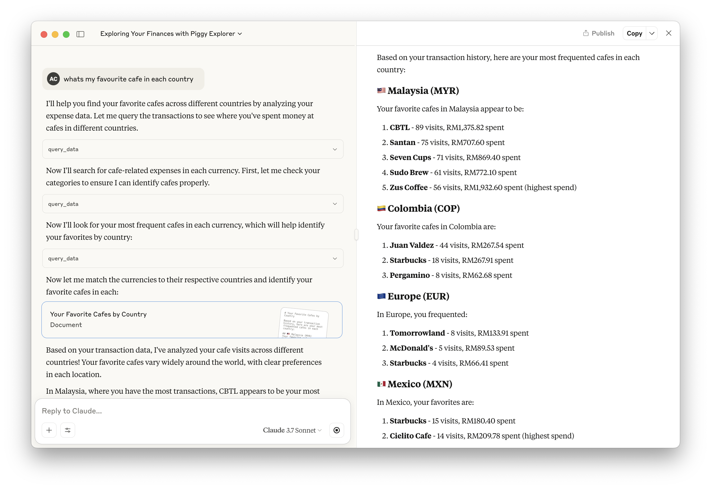

# Piggy MCP Server

Allows querying strange questions to [Realbyte's Money Manager](https://realbyteapps.com/) database.

## Setup

Install dependencies

```
git clone
uv sync
```

Start the inspector

```
bin/dev
```


Add it to Claude Desktop

```
bin/install
```

## Usage

1. On your iPhone, open Money Manager app.
2. Backup > Export > AirDrop to your Mac -- an mmbak file should appear in your Downloads folder.
3. Open Claude app, or any MCP client to interact with the file.
4. Some funny questions you can try asking:
    1. How has my coffee preference changed over the years?
    2. What countries have I visited in past 4 years, and whats my expenditures per day like?
    3. Forecast my spending on foods 5 years from now.

